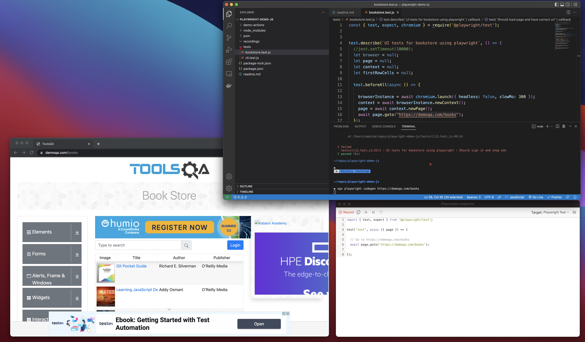

# Playwright with JavaScript - TAU Course by Ixchel Meza

This repo contains sample test fils that I used to learn [Playwright](https://playwright.dev/) and practice web UI test automation. Online course: [Playwright with JavaScript](https://testautomationu.applitools.com/js-playwright-tutorial/)



## Pre-requisites

- [Node.js](https://nodejs.org/en/)
- [Visual Studio Code](https://code.visualstudio.com/)
- [Introduction to JavaScript](https://testautomationu.applitools.com/javascript-tutorial/)

## Installation

You can clone this repository to your local or download it as zip but don't forget to do `npm install` prior to executing any test.

## Folder: POM

Contans files demonstrating how to write test using Page Object Model (POM).

## Folder: demo-actions 

Contains scripts demonstrating basic features of Playwright.

## Folder: tests

Contains scripts demnstraiting [Jest](https://jestjs.io/) tests.

## Usage 

```shell
npx playwright test tests/cli.test.js
```

```shell
▶ npm test pom/specs/demo.test.js            

> playwright-demo-wywm@1.0.0 test
> jest "pom/specs/demo.test.js"

 PASS  pom/specs/demo.test.js
  Aplitools demo page
    ✓ Should be able to login (204 ms)
    ✓ Should be logged in as Jack Gomez (15 ms)
    ✓ Should have total balance of $350 (9 ms)
    ✓ Should have credit available of $17800 (4 ms)
    ✓ Should have due today of $180 (4 ms)
```
